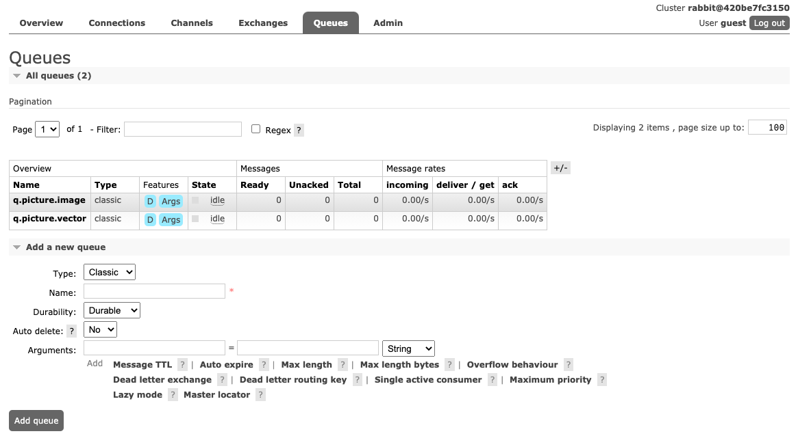
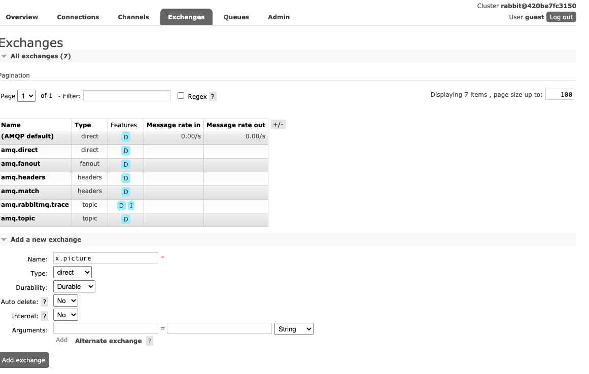
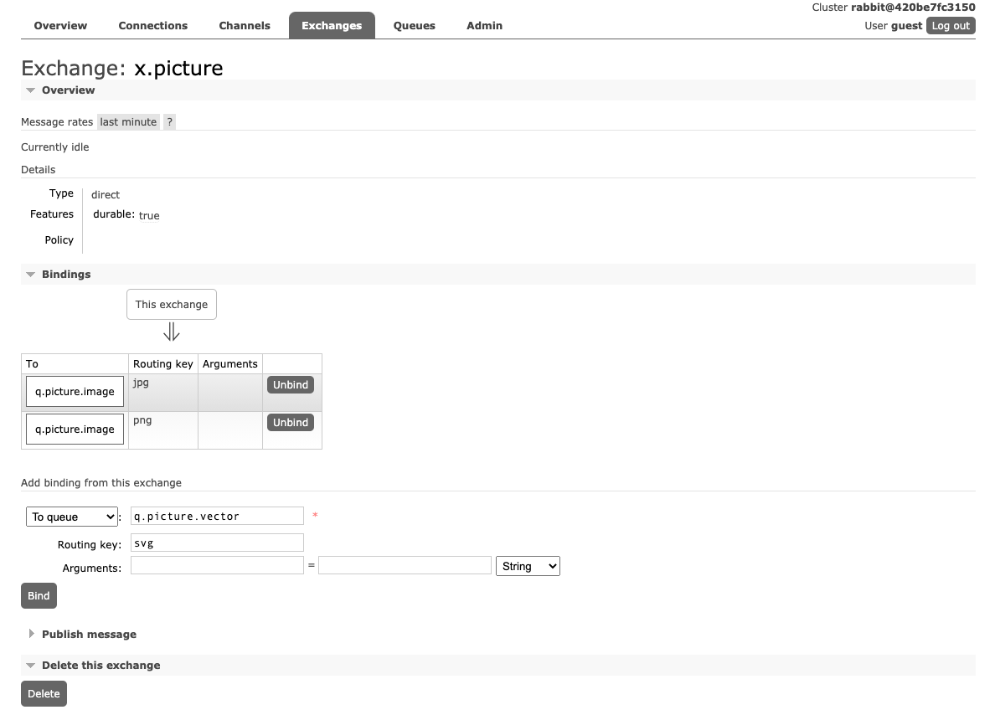
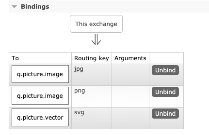

# RabbitMQ in Spring Boot Direct message
https://www.rabbitmq.com/tutorials/amqp-concepts.html#:~:text=A%20fanout%20exchange%20routes%20messages,the%20broadcast%20routing%20of%20messages.
Direct Exchange
A direct exchange delivers messages to queues based on the message routing key. A direct exchange is ideal for the unicast routing of messages (although they can be used for multicast routing as well). Here is how it works:

A queue binds to the exchange with a routing key K
When a new message with routing key R arrives at the direct exchange, the exchange routes it to the queue if K = R
Direct exchanges are often used to distribute tasks between multiple workers (instances of the same application) in a round robin manner. When doing so, it is important to understand that, in AMQP 0-9-1, messages are load balanced between consumers and not between queues.

A direct exchange can be represented graphically as follows:
## Add following Queues



######  We have to add following queues
* q.picture.image
* q.picture.vector

###### Screen shot add exchange x.hr


###### Bind queue with exchange x.hr



```
Execute rabbitmq-producer project.

```
###### To See detail information of each queue.

-----------
http://localhost:15672/
---------
https://github.com/ckgauro/rabbitMQExamples/blob/master/simpleRabbitMQMessage/rabbit-mq-message/ReadMe.md