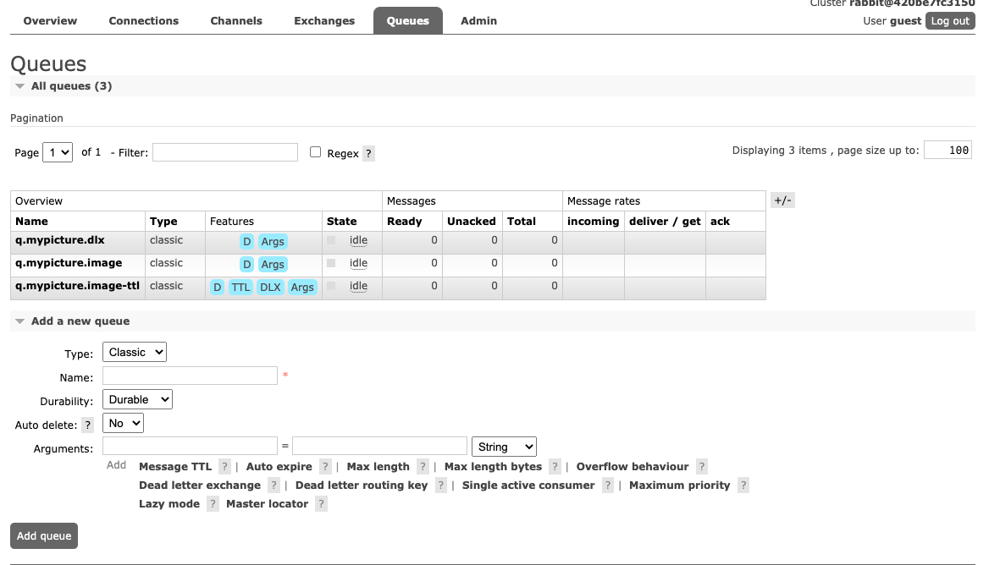
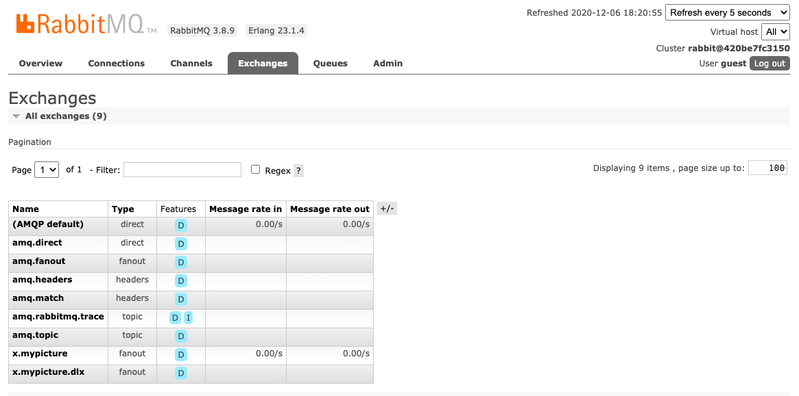
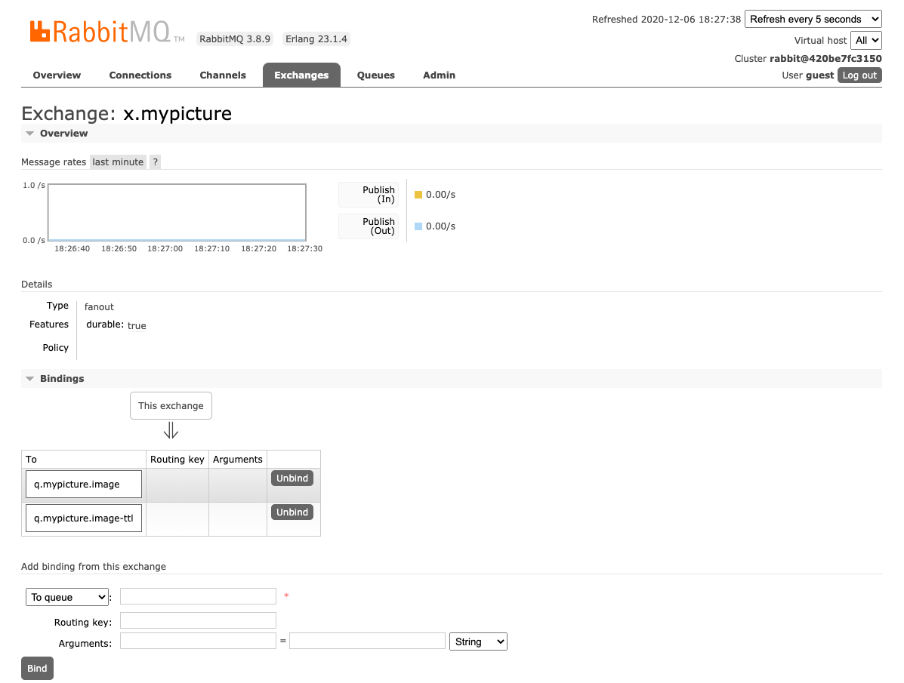
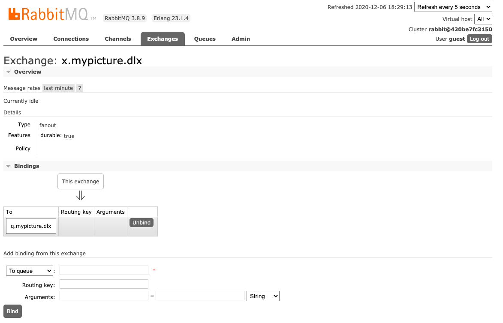
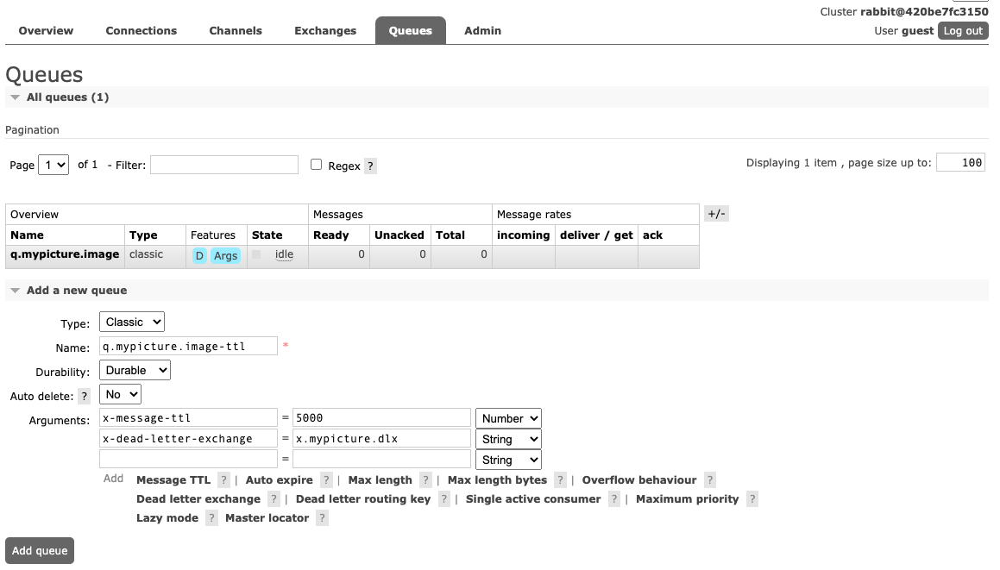

### Handling Exception on Consumer

This section will talk about basic error handling in RabbitMQ.

Message can live forever in a queue, if no consumer that consumes it. Or, message can be discarded and gone if something wrong happened during consumer logic.

RabbitMQ has a mechanism called DLX, or Dead Letter Exchange. Messages from a queue can be 'dead-lettered'; that is, republished to another exchange when any of the following events occur: 

* The message is rejected with requeue=false

* The TTL (time to live) for the message expires

* The queue length limit is exceeded

This mechanism is useful to handle invalid messages, without discard it.

In this section, we will learn about Dead Letter Exchange, and TTL (Time To Live), and of course we will do some java coding.

## Add following Queues

#### Screen shot add exchanges

#### Screen shot add My picture exchanges bind

#### Screen shot add My picture exchanges dlx bind

## Add following Queues TTL

