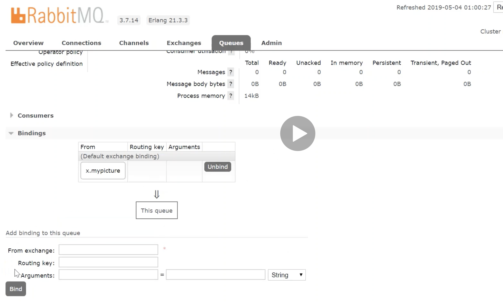

# RabbitMQ in Spring Boot Direct message
https://www.javainuse.com/messaging/rabbitmq/error

#### What is a Dead Letter Queue?
In English vocabulary Dead letter mail is an undeliverable mail that cannot be delivered to the addressee. A dead-letter queue (DLQ), sometimes which is also known as an undelivered-message queue, is a holding queue for messages that cannot be delivered to their destinations due to some reason or other.
According to Wikipedia page - In message queueing the dead letter queue is a service implementation to store messages that meet one or more of the following failure criteria:
Message that is sent to a queue that does not exist.
* Queue length limit exceeded.
* Message length limit exceeded.
* Message is rejected by another queue exchange.
* Message reaches a threshold read counter number, because it is not consumed. Sometimes this is called a "back out queue".


## Add following Queues


######  We have to add following queues
* q.mypicture.dlx
* q.mypicture.image

###### Screen shot add exchanges


###### Bind queue with exchange 


###### Bind queue with dlxqueue


###### Bind queue with dlxqueue


###### Bind queue with dlxqueue exception


```
Execute rabbitmq-producer project.

```
###### To See detail information of each queue.

-----------
http://localhost:15672/
---------
https://github.com/ckgauro/rabbitMQExamples/blob/master/simpleRabbitMQMessage/rabbit-mq-message/ReadMe.md