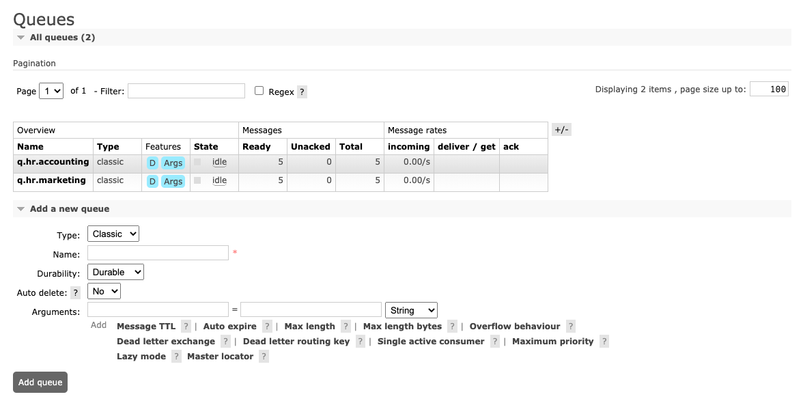
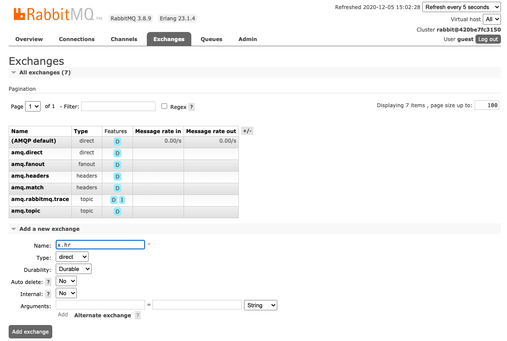
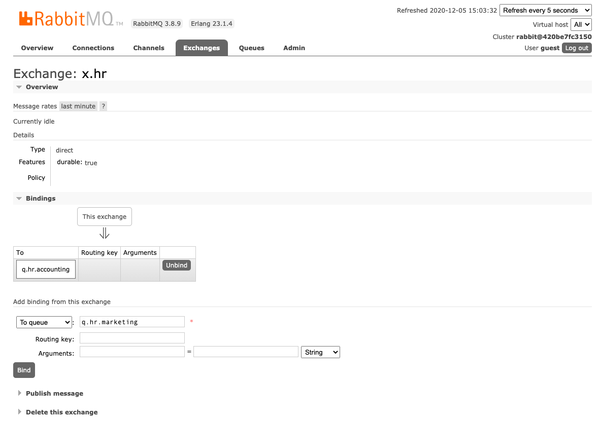

# RabbitMQ in Spring Boot Fanout message
https://www.rabbitmq.com/tutorials/amqp-concepts.html#:~:text=A%20fanout%20exchange%20routes%20messages,the%20broadcast%20routing%20of%20messages.

A fanout exchange routes messages to all of the queues that are bound to it and the routing key is ignored. If N queues are bound to a fanout exchange, when a new message is published to that exchange a copy of the message is delivered to all N queues. Fanout exchanges are ideal for the broadcast routing of messages.

Because a fanout exchange delivers a copy of a message to every queue bound to it, its use cases are quite similar:

Massively multi-player online (MMO) games can use it for leaderboard updates or other global events
Sport news sites can use fanout exchanges for distributing score updates to mobile clients in near real-time
Distributed systems can broadcast various state and configuration updates
Group chats can distribute messages between participants using a fanout exchange (although AMQP does not have a built-in concept of presence, so XMPP may be a better choice)

## Add following Queues



######  We have to add following queues
* q.hr.accounting
* q.hr.marketing

###### Screen shot add exchange x.hr


###### Bind queue with exchange x.hr


```
Execute rabbitmq-producer project.

```
###### To See detail information of each queue.
http://localhost:15672/

