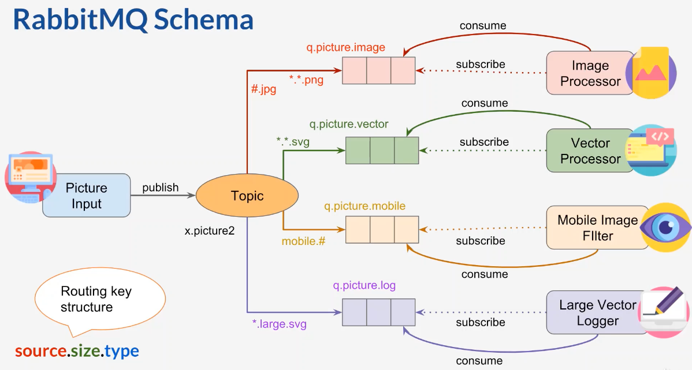
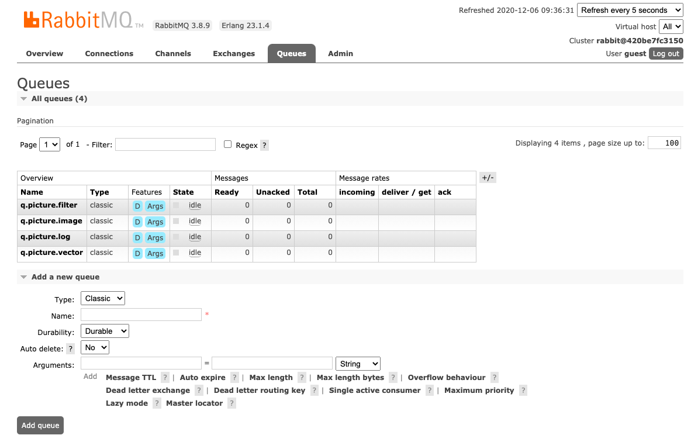
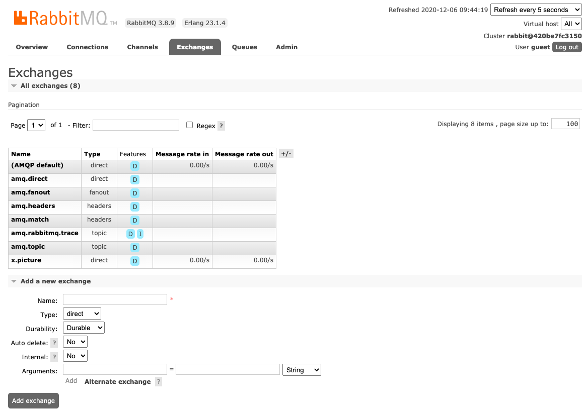
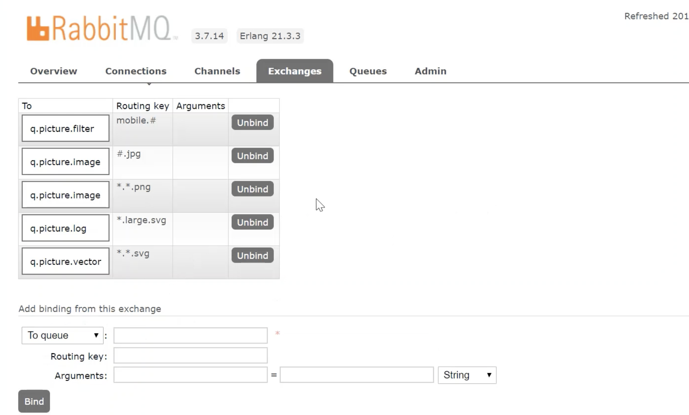

# RabbitMQ in Spring Boot Direct message
https://www.rabbitmq.com/tutorials/tutorial-five-swift.html

opic exchange
Messages sent to a topic exchange can't have an arbitrary routingKey - it must be a list of words, delimited by dots. The words can be anything, but usually they specify some features connected to the message. A few valid routing key examples: "stock.usd.nyse", "nyse.vmw", "quick.orange.rabbit". There can be as many words in the routing key as you like, up to the limit of 255 bytes.

The binding key must also be in the same form. The logic behind the topic exchange is similar to a direct one - a message sent with a particular routing key will be delivered to all the queues that are bound with a matching binding key. However there are two important special cases for binding keys:

* (* star) can substitute for exactly one word.
* (# hash) can substitute for zero or more words.

A Topic  exchange can be represented graphically as follows:
## Add following Queues


## Add following Queues



######  We have to add following queues
* q.picture.filter
* q.picture.image
* q.picture.log
* q.picture.vector

###### Screen shot add exchange x.hr


###### Bind queue with exchange x.picture


```
Execute rabbitmq-producer project.

```
###### To See detail information of each queue.

-----------
http://localhost:15672/
---------
https://github.com/ckgauro/rabbitMQExamples/blob/master/simpleRabbitMQMessage/rabbit-mq-message/ReadMe.md